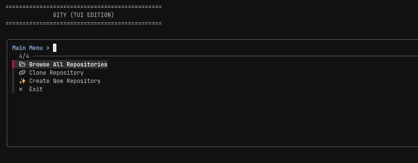

# Gity

**A beautiful, keyboard-driven TUI hub for managing all your Git repositories in one place.**

No more hunting for repos across your filesystem. Gity automatically discovers all your Git repositories and brings them together in a fast, elegant fzf-powered interface.



## Features

- **Auto-Discovery** — Scans your home directory and finds all Git repos automatically
- **Fuzzy Search** — Instantly filter through hundreds of repos with fzf
- **Recent First** — Your most-used repos always appear at the top
- **Clone & Create** — Clone new repos or create new ones from the app
- **Quick Actions** — Open in Lazygit, VS Code, or your file manager with one keypress
- **Smart Clipboard** — Copies repo paths when clipboard tools are available
- **Zero Config** — Works out of the box on Arch, Ubuntu, Fedora, macOS, and more

## Requirements

- [lazygit](https://github.com/jesseduffield/lazygit) — The terminal UI for Git commands
- [fzf](https://github.com/junegunn/fzf) — Fuzzy finder for the interface
- `git` — Version control
- `xdg-open` — For opening in file manager (usually pre-installed)
- A clipboard tool (`xclip`, `xsel`, or `wl-copy`) — optional, for copy functionality

## Installation

### One-Line Install

```bash
bash <(curl -sL https://github.com/ehtishamnaveed/gity/install.sh)
```

This will:
- Detect your Linux distribution or macOS
- Automatically install all required dependencies
- Install Gity to `~/.local/bin/gity`
- Add `~/.local/bin` to your PATH if needed

### Manual Install

1. Ensure `git`, `fzf`, and `lazygit` are installed on your system
2. Copy `gity.sh` to a directory in your PATH:

```bash
cp gity.sh ~/.local/bin/gity
chmod +x ~/.local/bin/gity
```

3. Add `~/.local/bin` to your PATH in `~/.bashrc` or `~/.zshrc`:

```bash
export PATH="$HOME/.local/bin:$PATH"
```

## Supported Distributions

| Distribution | Install Command |
|---|---|
| Arch Linux | `sudo pacman -S git fzf lazygit` |
| Ubuntu / Debian | `sudo apt install git fzf lazygit` |
| Fedora | `sudo dnf install git fzf lazygit` |
| OpenSUSE | `sudo zypper install git fzf lazygit` |
| Void Linux | `sudo xbps-install git fzf lazygit` |
| macOS | `brew install git fzf lazygit` |

## Usage

Run Gity from your terminal:

```bash
gity
```

### Main Menu

| Option | Description |
|---|---|
| **Browse All Repositories** | Search and open an existing repo |
| **Clone Repository** | Clone a new repo from URL |
| **Create New Repository** | Initialize a new repo with an initial commit |
| **Exit** | Quit Gity |

### Repository Actions

After selecting a repo, you can:

| Action | Description |
|---|---|
| **Open in Lazygit (TUI)** | Launch lazygit in that repository |
| **Open in VSCode** | Open repo in Visual Studio Code |
| **Open in File Manager** | Open repo folder in your file browser |
| **Copy Path to Clipboard** | Copy the repo path to your clipboard |

### Keyboard Navigation

- Use **arrow keys** or **vim-style (j/k)** to navigate
- Press **Enter** to select
- Press **Escape** or select empty to go back
- Type to **fuzzy search** filter the list

## How It Works

1. **First Run** — Gity scans your home directory for `.git` folders and builds a cache
2. **Caching** — Repo list is stored in `~/.cache/lazygit_repos` for fast access
3. **Recent Repos** — Your last 10 opened repos are tracked in `~/.cache/lazygit_recent`
4. **Smart Scanning** — Deep scan `~/Work`, `~/Plugins`, `~/Documents`, `~/Desktop`, `~/Luminor`, plus broad home scan (excluding cache directories)

## Configuration

Gity works with zero configuration, but you can customize:

| Variable | Default | Description |
|---|---|---|
| `REPO_DIR` | `~/Documents/Github` | Where cloned repos are saved |
| `CACHE_FILE` | `~/.cache/lazygit_repos` | Repo discovery cache |
| `RECENT_FILE` | `~/.cache/lazygit_recent` | Recently opened repos |

To override, edit `gity.sh` directly.

## Uninstall

```bash
rm ~/.local/bin/gity
rm ~/.cache/lazygit_repos
rm ~/.cache/lazygit_recent
```

Remove the PATH line from your `~/.bashrc` or `~/.zshrc` if added by the installer.

## Contributing

Contributions are welcome! Feel free to open issues or submit pull requests.

## License

MIT License — see [LICENSE](LICENSE) for details.

## Acknowledgments

- [lazygit](https://github.com/jesseduffield/lazygit) by Jesse Duffield
- [fzf](https://github.com/junegunn/fzf) by Junegunn Choi
